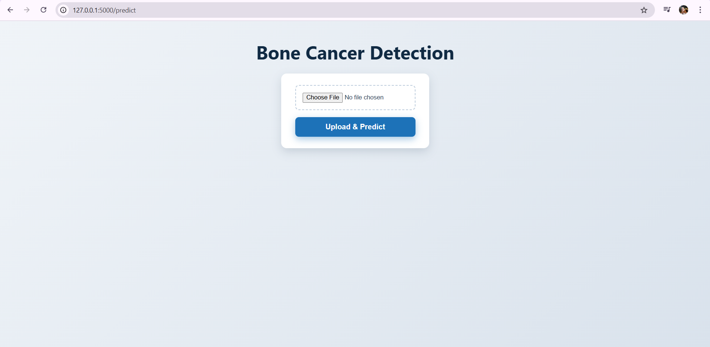
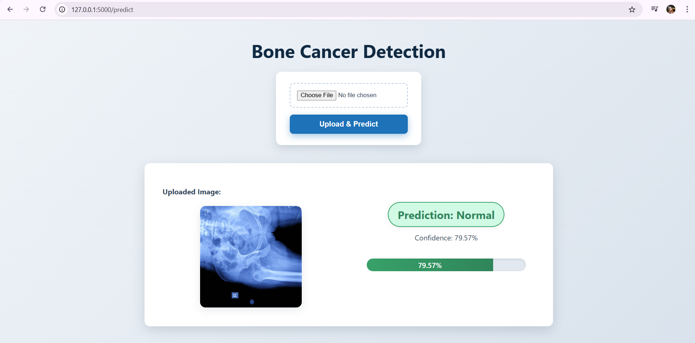
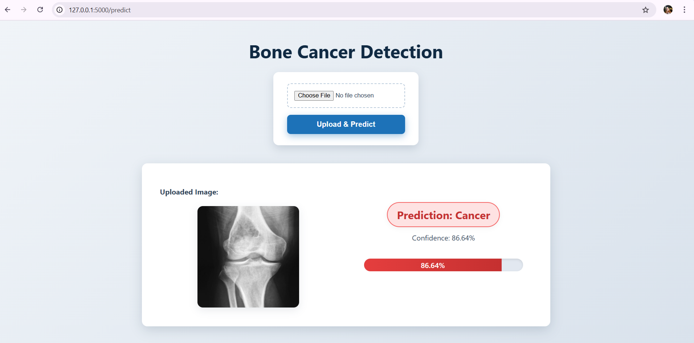
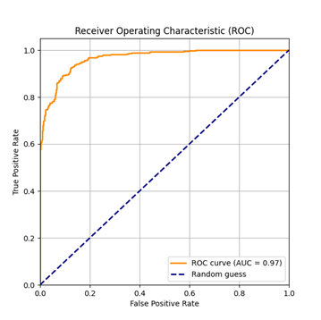

# Bone Cancer Detection using Deep Learning

This project applies a **Convolutional Neural Network (CNN)** to classify bone X-ray images into **Cancer** or **Normal**.  
The trained model is deployed using a **Flask web interface** to allow users to upload images and get real-time predictions.

## 🧠 Project Idea
Bone cancer diagnosis through medical imaging is often complex and time-consuming.  
This project builds a **deep learning model** that can automatically detect bone cancer from X-ray images and provide a confidence score for the prediction.

---
## ⚙️ Technologies Used
- **Python**
- **TensorFlow / Keras**
- **Flask** – for the interactive web interface  
- **NumPy**, **Matplotlib**, **Pandas**
- **Pillow (PIL)**, **Scikit-learn**
- **HTML / CSS** – for web UI design

---
## 📊 Project Stages
1. **Data Collection** – bone X-ray images categorized as *Cancer* or *Normal*.  
2. **Data Preprocessing** – using `ImageDataGenerator` and `Data Augmentation`.  
3. **Model Building** – CNN architecture with multiple convolutional layers.  
4. **Training the Model** – fine-tuned with the Adam optimizer.  
5. **Evaluation** – accuracy, confusion matrix, and ROC curve.  
6. **Web Deployment** – Flask interface for uploading and testing images.

## 🧪 Model Results
- ✅ **Test Accuracy:** ~91%  
- 📈 **AUC (ROC Curve):** 0.97  
The model achieved an accuracy of 91% and an AUC of 0.97, which indicates that while a few predictions might be slightly off around the decision threshold, the model overall has a very strong ability to distinguish between cancerous and normal images.

---
## 🖼️ Flask Web Interface
The Flask web app allows users to upload an X-ray image, analyze it, and instantly display the prediction along with the confidence level.

graph TD;

    A[Upload X-ray Image] --> B[Image Preprocessing];
    
    B --> C[Send to CNN Model];
    
    C --> D[Prediction Generation];
    
    D --> E[Display Result & Confidence Score];

| File / Folder                 | Description                   |
| ----------------------------- | ----------------------------- |
| `app.py`                      | Flask web application         |
| `templates/`                  | HTML templates for Flask      |
| `training.ipynb`              | Jupyter Notebook for training |
| `requirements.txt`            | Python dependencies           |

## 📂 Datasets & Model

Dataset used: https://drive.google.com/drive/folders/1tPPzQVHy09LXfptV-mpAc91LVnm_2_FX?usp=drive_link

Trained Model: https://drive.google.com/drive/folders/1AquyK98Bw-yVq9KKm857Q8CwkdQd6UJZ?usp=drive_link

## 🌍 Future Improvements

**-** Integrate with real hospital systems for automated screening.

**-** Add support for other cancer types.

**-** Use advanced architectures like ResNet or EfficientNet for higher accuracy.

**-** Build an admin dashboard for doctors to manage patient results.

## 🧾 Notes

**-** Dataset and model files are too large to be stored on GitHub.

**-** All experiment notebooks and trained models are linked via Google Drive.

**-** This project was developed as part of a Bachelor’s Graduation Project in Software Engineering.

## 💻 Flask Interface

Below is a screenshot of the Flask web interface where users can upload an X-ray image and get the prediction result in real time:

  

## 🖼️ Flask Interface Demonstration

Below are screenshots from the Flask web interface showing how the system predicts and displays the results for both classes:

 ## 🟩 Normal Case

When an X-ray image of a healthy bone is uploaded, the system predicts it as Normal, highlighted in green to indicate a safe condition.

  

 ## 🟥 Cancer Case

When an X-ray image of a cancerous bone is uploaded,
the system predicts it as Cancer, highlighted in red to alert the user about a possible malignancy.

  

## 📈 ROC Curve

The following figure shows the ROC Curve generated from the model evaluation phase.
It demonstrates the model’s excellent ability to distinguish between cancer and normal images, with an AUC of 0.97:

  

